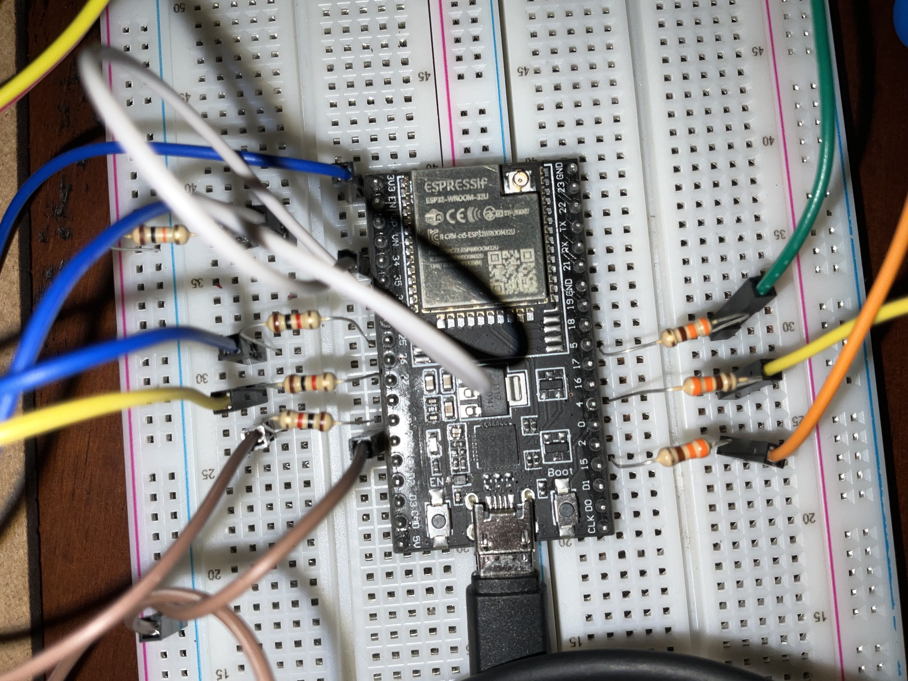
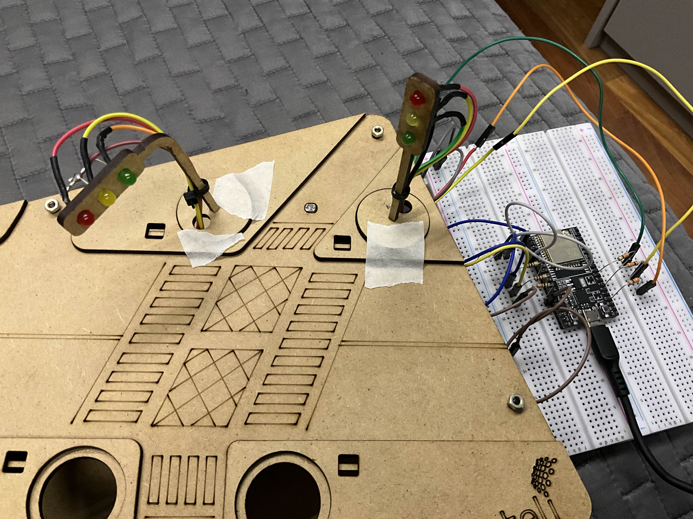

# Semáforos LED com sensor fotoresistor usando ESP32
  
### Peças usadas:
- ESP32-DEVKITC-32U
- 6x LED 5mm (2x vermelho, 2x amarelo, 2x verde)
- 6x Resistor 330 Ohms 5%, 1x Resistor 10k Ohms 5%
- Sensor Fotoresistor LDR
- Cabos jumper M-M e M-F
- Tábua MDF cortada à laser

---

Esse projeto consiste em um sistema de dois semáforos que funcionam simultaneamente, mas também com a ajuda do sensor LDR, conseguem detectar mudanças na luminosidade. Além disso, o sistema conecta-se à internet para enviar e receber requisições por MQTT, permitindo comunicação sem fio com o dispositivo.

### Features:
- Funcionamento simultâneo dos semáforos com ou sem internet
- Alternância automática entre modo diurno e noturno dependendo da luminosidade
- Recebimento de comandos por requisições MQTT
- Detecção de passagem de carros e registro da atividade por requisição MQTT

O sensor LDR foi implementado de maneira que, quando há luminosidade alta, o semáforo permanece no modo diurno. No momento que uma redução na luz é detectada, o sistema aguarda para ver quanto tempo a luz irá permanecer reduzida. Se a luminosidade reduzir e aumentar rapidamente, o sistema ignora a mudança, pois é provavelmente um falso positivo. Se a luz permanecer baixa por um intervalo específico (50ms no código atual) mas depois aumentar, essa mudança é interpretada como a passagem de um carro, e então (se possível) registra isso por MQTT. Se a luz permanecer reduzida por um intervalo maior (3 segundos no código atual), o sistema alterna para o modo noturno, e permanece nele até algum aumento na luz ser detectado novamente.  

---

## Como usar interface MQTT para comunicar com o dispositivo
Primeiramente, deve-se trocar no código a configuração do WiFi para sua rede.

Feito isso, a não ser que deseje usar um cliente próprio para o broker do MQTT, pode-se utilizar o broker público Mosquitto já implementado no código.  
Conecte-se no [Websocket Client HiveMQ](https://www.hivemq.com/demos/websocket-client/) e digite as seguintes informações:

**Host:** *test.mosquitto.org*  
**Port:** *8081*

Feito isso, basta clicar em Connect, e então inscrever-se no tópico "*semaforo_output*" para receber as mensagens enviadas pelo dispositivo.

Para enviar comandos, vá em Publish e digite o tópico "*semaforo_input*" e digite o comando que deseja enviar, e depois clique em Publish.

### Comandos Disponíveis:
- *day*: Força o modo diurno (ignora LDR)
- *night*: Força o modo noturno (ignora LDR)
- *reset*: Restaura atributos padrão (reativa LDR)
- *party*: Comando de debug, força o modo diurno e diminui intervalo de troca das luzes. (ignora LDR)

Se o dispositivo receber o comando com sucesso, ele enviará uma mensagem de resposta no tópico *semaforo_output* para atestar isso.  
Ademais, o dispositivo comunica também se detectar algum movimento acima do seu sensor LDR, enviando uma mensagem especial nesse caso.

Tudo isso dando certo, você conseguirá comunicar com os semáforos por qualquer dispositivo que desejar (Desde que tenha acesso à internet).
